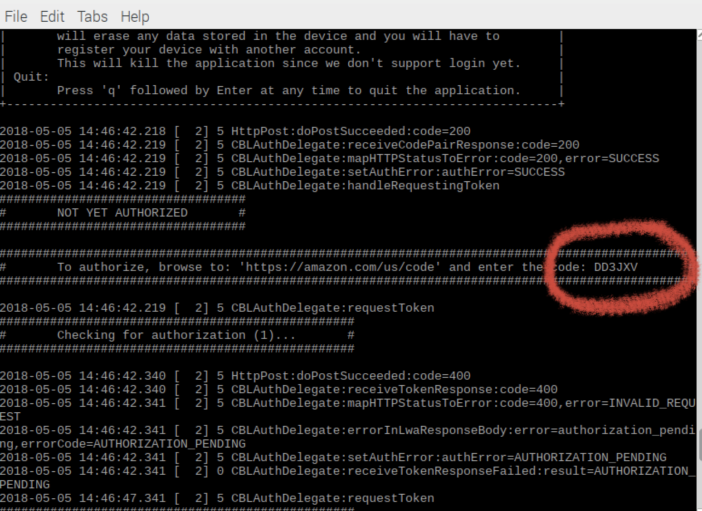

When you run the sample app for the first time, you'll need to authorize your client for access to AVS.

Initialize the sample app by pasting or typing the following command into your terminal:


```
bash /home/pi/avs_run.sh
```

Wait for the sample app to display a message like the one in the picture below (but, a different code of course) -  If you don't see this, but you see "waiting for authorization" messages going by, then **scroll up**!  It's easy to miss the authorization code since the terminal window fills up pretty fast.  **Note - you need to leave this process running while you authorize, don't close the window or otherwise stop the startsample script.** If the script exits immediately, a possible cause is that your microphone is not plugged in properly.



 1. Use any browser (does NOT have to be on the Pi) to navigate to [amazon.com/us/code](https://amazon.com/us/code)   
 2. Authenticate using your Amazon user credentials.  If you aren't able to log in - try deleting all cookies or open a new tab in "guest mode" browser, then go to [amazon.com/us/code](https://amazon.com/us/code).  You can also just go to the link from your phone, laptop, or any connected device, and it should work.
 3. Enter the code specified in the message from sample app.  
 4. Select “Allow”.  
 5. Wait (it may take as long as 30 seconds) for CBLAuthDelegate to successfully get an access and refresh token from Login With Amazon (LWA).  
 6. At this point the sample app will print a message informing you that you are now authorized!  

Your raspberry pi is now ready to use the sample app. The next time you start the sample app, you will not need to go through the authorization process.

Now, since we are building the Smart Screen SDK, you'll need to open a browser to use the visual interface for your prototype.  Open the Chromium browser and then copy/paste the following URL into your browser (or use the first bookmark in the tab above, just make sure you open in a new tab!): 

`file:///home/pi/sdk-folder/ss-build/modules/GUI/index.html?insecure=1`

Note, this should autocomplete in your browser when you start typing - it's also in the bookmarks as "Alexa Home Screen".

Congrats on your progress so far!  Now it's time to talk with Alexa.


