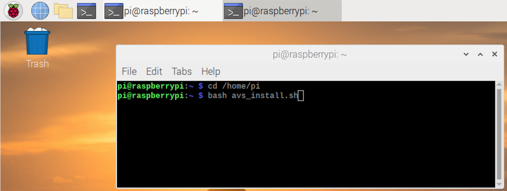

### Run the Install Script

You are now ready to run the install script. This will install all dependencies, including the **Wake Word Engine** (WWE) from Sensory.  The WWE compares incoming audio to an onboard model of a wake word (**"Alexa"**) and will initiate the transmission of audio to the cloud when triggered.  Note that this WWE is provided for **prototyping purposes only** and would need to be licensed for a commercial device.  The AVS Device SDK is modular and flexible. When you're ready to build your product, you can choose any WWE you prefer. Remember that for AVS products, the wake word must be **Alexa** so that your customers aren't confused about how to interact with your device.

To run the install script, open a **terminal** by clicking on the console window in the Pi’s toolbar in the upper-left corner of the screen (or just use your existing terminal window). This script will use the device information from your **config.json** file as part of the installation. To launch the install script, copy and paste the following command into your terminal window and hit return:


```
bash /home/pi/avs_install.sh
```





Type **"y"** when it prompts you to accept the licensing terms from our third-party libraries.  Unless, of course, you disagree!

This will kick off the installation process which could normally take over one hour, but for reInvent we've precompiled the Smart Screen SDK and it's dependencies to save you some time.

Once the installation is complete, you should see a success message on the terminal: "Installation completed". 

If you need to recompile the sdk at some point post-workshop due to an update or manual modification, you should close any other processes like browsers on the pi as memory consumption during the compilation process is high. Compiling the SDK in non-GUI mode (**Shell/Terminal command: runlevel 3**) will help free up memory to compilation can happen more reliably and quickly. If your device freezes up - don't worry, just restart by unplugging your Pi's power cord.


Next we will launch the sample app and get a refresh token from AVS so your device can authenticate with the cloud via Login With Amazon (LWA).  


