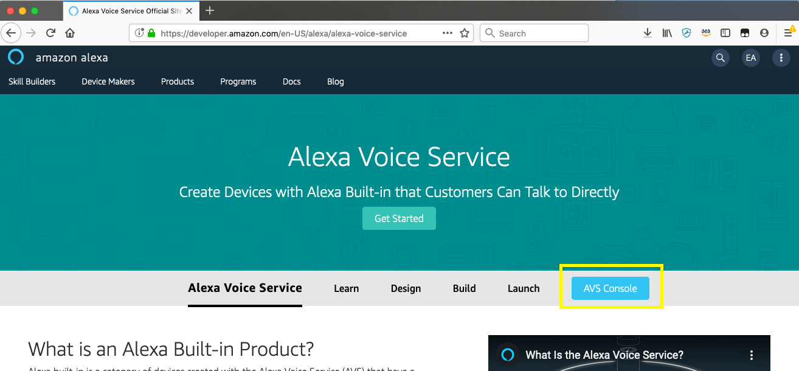

### Register your prototype and create a security profile

After you've created an Amazon developer account, you'll need to create a product and security profile. This will enable your software client to connect to AVS.

Log in to [developer.amazon.com](https://developer.amazon.com/login.html).  You should be in the Dashboard by default - click the **Alexa** button on the screen, then **Build Alexa Devices** and then finally **AVS Console**. the global navigation to start building products with Alexa built-in.  

If you are having trouble, try this direct link:  [https://developer.amazon.com/alexa/console/avs/welcome](https://developer.amazon.com/alexa/console/avs/welcome)

If this is your first time using AVS, you'll see a welcome screen. Click the **GET STARTED** button, then click the **CREATE PRODUCT** button.

If you're a returning developer that has already created products in your dashboard, click the blue **CREATE PRODUCT** button at the top right corner of the screen to start building a new device profile.

### Fill in product information

1. *Product Name*: Use **AVS Tutorials Project**.
2. *Product ID*: Use **PrototypePi.** No spaces are allowed for the *Product ID* field.
3. Select **Device with Alexa built-in** for *Please Select Your Product Type*.
  Select **No** for *Will your device use a companion app?*
4. Choose **Other** for *Product Category* and write **Prototype** in the *(please specify)* and *Brief product description* field.
5. Select **Hands-free** for *How will users interact with your product?*
7. Skip the *Upload an image* step.  This is not required for prototyping.
8. Select **No** for *Do you intend to distribute this product commercially?*
9. Select **No** for *Will your device be used for Alexa for Business?*
10. Select **No** for *Is this product associated with AWS IoT Core?*
11. Select **No** for *Is this a children’s product or is it otherwise directed to children younger than 13 years old?*
12. Click **NEXT** to continue.

### Set up your security profile

1. Click **CREATE NEW PROFILE**.  

2. Enter your own custom **Security Profile Name** and **Security Profile Description** for the following fields - or use the below example names:   
	 - *Security Profile Name*: **AVS Tutorials Project**
	 - *Security Profile Description*: **AVS Tutorials**
	 - Click **NEXT**.  

	 **Security Profile ID** will be generated for you.

3. Select **Other devices and platforms** from the *Web - Android/Kindle - iOS - Other devices and platforms* options in the **Platform Information** section.

   - Write a name for your Client ID here - you can just use **Prototype**.
   - Click "Generate ID".  You should get a Client ID and an option to download it.
   - Click **Download** to install a file called `config.json` that is used to identify your AVS prototype product.  When you click download, it'll automatically put it in your `/home/pi/Downloads` folder.
   - Check the box beside *I agree to the AVS agreement and the AVS Program Requirements.*
	 - Click **FINISH**.

Congratulations!  You now have access to the Alexa Voice Service APIs.  Click OK on the prompt to continue.  Your device should now be listed on your [AVS dashboard](https://developer.amazon.com/avs/home.html#/avs/homes).
